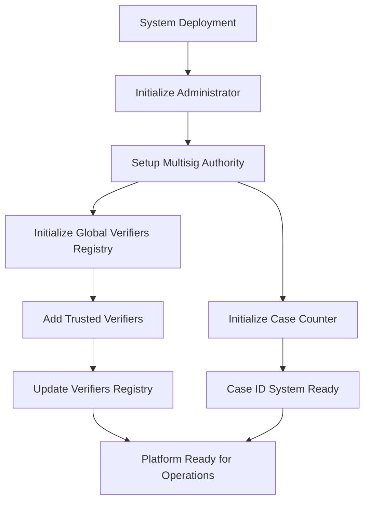
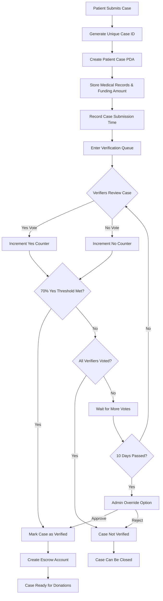
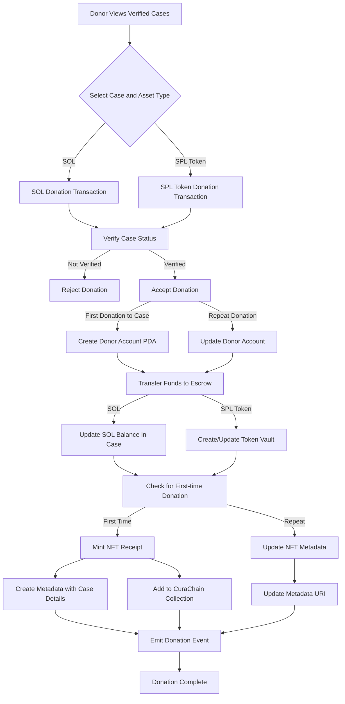
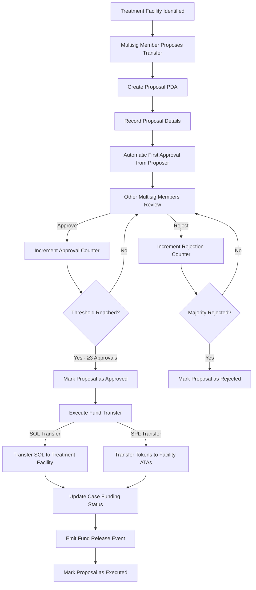
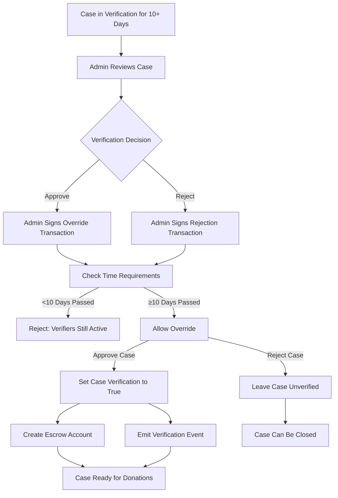
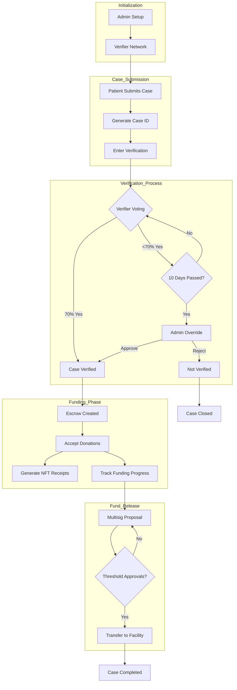

# CuraChain: Decentralized Medical Crowdfunding Protocol

[](https://opensource.org/licenses/MIT)

CuraChain is a blockchain-based medical crowdfunding platform built on the Solana network. It provides a transparent, secure, and efficient way to connect patients requiring medical funding with donors worldwide, ensuring that funds reach verified patients through a robust verification and escrow system.

## Table of Contents

- [Core Features](#core-features)
- [Technical Architecture](#technical-architecture)
- [Verification System](#verification-system)
- [NFT System](#nft-system)
- [Fund Management](#fund-management)
- [Use Cases](#use-cases)
- [Project Flow](#project-flow)
- [Getting Started](#getting-started)
- [Contributing](#contributing)
- [License](#license)

## Core Features

### Patient Case Management
- **Case Submission**: Patients can submit medical cases with detailed descriptions, treatment cost estimates, and supporting documentation links
- **Unique Identifiers**: Each case receives a unique ID (e.g., "CASE0001") for easy reference and tracking
- **Case Lookup**: Efficient on-chain mechanism to retrieve case details using unique identifiers

### Advanced Verification System
- **Trusted Verifier Network**: Platform administrators maintain a network of authorized medical verifiers
- **Quorum-based Verification**: 70% of verifier votes required for case approval
- **Time-constrained Verification**: Verifiers must complete verification within 10 days
- **Admin Override**: Administrators can approve or reject cases after the 10-day verification window to prevent stalled cases
- **Rejection Management**: Ability to close rejected cases to maintain system cleanliness

### Secure Fund Management
- **Escrow System**: All donations are held in secure program-derived address (PDA) escrows
- **Multi-signature Authorization**: Fund release requires multiple authorizations (default: 3 signatures)
- **Dual-asset Support**: Accept both SOL and SPL token donations
- **Token Vaults**: Separate token vaults created for different SPL token donations
- **Treatment Facility Payments**: Direct disbursement to verified treatment facilities

### NFT Receipt System
- **Donation Verification**: NFT receipts provide immutable proof of contribution
- **Metadata-rich Tokens**: Includes details about donation amount, recipient case
- **Collection Hierarchy**: Organized in a collection for easy verification and tracking
- **URI-based Metadata**: Supports customizable metadata to enhance donor experience

### Event Tracking
- **On-chain Event Logging**: Comprehensive event system for tracking all actions
- **Transaction Verification**: Ability to verify all operations through blockchain explorers
- **Audit Trail**: Complete history of case verification, donations, and fund releases

## Technical Architecture

### Smart Contract Design
Built using the Anchor framework on Solana with a focus on security, efficiency, and scalability-

#### Account Structure
- **Administrator Account**: Controls platform operations, verifier management
- **Verifier Accounts**: Authorized entities that validate patient claims
- **Patient Case Accounts**: Stores patient information, funding goals, and verification status
- **Case Counter & Lookup**: Global counter and efficient lookup system for case ID management
- **Escrow Accounts**: Secure holding for donated funds with multisig release
- **Donor Accounts**: Tracks donations and enables NFT receipt issuance
- **Proposal Accounts**: Manages fund release proposals and approvals

#### Security Design
- **Program Derived Addresses (PDAs)**: Used for secure, deterministic account derivation
- **Bump Seed Management**: Properly manages PDA derivation to prevent collision attacks
- **Authority Checks**: Strict checks on account authorities and signers
- **Time-based Controls**: Enforces time windows for operations like verification

#### Core Features Implementation
- **Time-based Verification Window**: 
  ```rust
  // Only allow admin override after 10 days from submission
  let now = Clock::get()?.unix_timestamp;
  require!(
      now >= patient_case.submission_time + ALLOWED_VERIFICATION_TIME as i64, 
      CuraChainError::VerifiersVerificationActive
  );
  ```

- **Verifier Quorum System**:
  ```rust
  // Check if yes votes is 70% of total votes
  let approval_threshold_70_scaled = total_votes_u32_scaled
      .checked_mul(70)
      .ok_or(CuraChainError::OverflowError)?
      .checked_div(100)
      .ok_or(CuraChainError::OverflowError)?;
  ```

- **Fund Management**:
  ```rust
  // Multisig requirement (default: 3 signers)
  pub const MULTISIG_THRESHOLD: u8 = 3;
  ```

## Verification System

CuraChain implements a sophisticated multi-level verification system:

### Verifier Network
1. **Verifier Registration**: Administrators add trusted medical verifiers to the platform
2. **Global Registry**: All authorized verifiers are tracked in a global registry
3. **Verifier Rotation**: Administrators can add or remove verifiers as needed

### Verification Process
1. **Case Submission**: Patient submits case with medical documentation
2. **Verifier Review**: Authorized verifiers review the case and vote (yes/no)
3. **Quorum Check**: System calculates if 70% of votes are positive
4. **Automated Verification**: Case automatically verified when quorum reached
5. **Escrow Creation**: Upon verification, system automatically creates donation escrow

### Admin Override Functionality
The platform includes a time-sensitive admin override capability:
1. **Time Window**: Verifiers have 10 days (864,000 seconds) to vote
2. **Verification Deadlock**: If verifiers don't respond within timeframe
3. **Admin Action**: Administrator can override and approve/reject case
4. **Escrow Management**: If approved, escrow is automatically created

## NFT System

CuraChain incorporates an innovative NFT-based donation receipt system:

### NFT Collection
1. **Master Collection**: Platform maintains a master NFT collection
2. **Collection Verification**: All donation NFTs are verified members of the collection
3. **Metadata Structure**: Standardized metadata format for all donation receipts

### Donor Experience
1. **First Donation**: First-time donors to a case receive an NFT receipt
2. **Metadata Storage**: NFT includes donation details and case information
3. **URI-based Metadata**: Supports rich metadata through customizable URIs
4. **Metadata Updates**: For repeat donors, metadata is updated with new donation information

### Implementation Details
```rust
// Create Metadata Account For First-time Donations
let data_v2 = DataV2 {
    name: format!("Recognition NFT -- {}", case_id),
    symbol: "CURA".to_string(),
    uri: nft_uri,
    seller_fee_basis_points: 0,
    creators: None,
    collection: Some(Collection {
        verified: false,
        key: ctx.accounts.parent_recognition_collection_nft.key(),
    }),
    uses: None
};
```

## Fund Management

### Donation Process
1. **Verified Cases Only**: System only allows donations to verified cases
2. **Multiple Asset Types**: Support for both SOL and SPL token donations
3. **Token Vaults**: Creation of specific vaults for each token type
4. **Donation Tracking**: All donations tracked on-chain with donor information
5. **Donation Limits**: Prevents over-funding of cases with configurable buffer

### Fund Release
1. **Proposal Creation**: Any multisig member can propose fund release
2. **Approval Process**: Requires approval from minimum threshold of members (default: 3)
3. **Execution**: Transfers funds directly to specified treatment facility
4. **SPL Handling**: Creates associated token accounts for treatment facility if needed
5. **Tracking**: All transfers are tracked with on-chain events

### Multisig Implementation
```rust
// AUTHORIZED MULTISIG TRANSFERS ACCUMULATED FUNDS TO TREATMENT WALLET 
pub fn release_funds<'info>(ctx: Context<'_, '_, '_, 'info, ReleaseFunds<'info>>, 
    case_id: String, proposal_index: u64) -> Result<()> {
    instructions::release_funds(ctx, case_id, proposal_index)?;
    Ok(())
}
```

## Use Cases

### For Patients
- **Global Reach**: Access donors worldwide without geographic limitations
- **Transparent Process**: Clear verification system builds donor trust
- **Reduced Fraud Risk**: Verified medical cases prevent fraudulent fund collection
- **Direct Payment**: Funds transferred directly to treatment facilities

### For Donors
- **Verified Recipients**: Confidence that donations reach legitimate patients
- **Donation Proof**: NFT receipts provide verifiable donation records
- **Multiple Assets**: Flexibility to donate SOL or SPL tokens
- **Transparent Tracking**: Full visibility into fund collection and disbursement

### For Healthcare Providers
- **Reliable Funding**: Direct access to verified funds for patient treatment
- **Administrative Efficiency**: Reduced paperwork through blockchain automation
- **Global Patient Pool**: Connect with patients seeking funding from anywhere
- **Automated Disbursement**: Streamlined payment process with multisig security

## Project Flow

Below are comprehensive Mermaid diagrams explaining the CuraChain protocol operations in detail:

### 1. Platform Initialization Flow



### 2. Patient Case Submission and Verification Flow



### 3. Donation Process and NFT Receipt System Flow



### 4. Fund Release and Multisig Approval Flow



### 5. Admin Override Process After 10-Day Period



### 6. Complete System Interaction Flow



### Detailed Process Flow Description:

1. **Platform Initialization**:
   - Administrator account is created with required permissions
   - Multisig authority established with configurable threshold (default: 3)
   - Global verifiers registry initialized to track authorized medical validators
   - Case counter PDA setup to generate sequential case IDs

2. **Patient Submission Flow**:
   - Patient submits medical case with documentation and funding goal
   - System assigns unique identifier (e.g., "CASE0001") through case counter
   - Patient case PDA created and linked to submitter's wallet
   - Submission timestamp recorded for verification deadline tracking

3. **Verification Process**:
   - Authorized verifiers review case documentation
   - Each verifier casts a single vote (yes/no) with duplicate prevention
   - System tracks verification statistics in patient case account
   - If 70% of verifiers approve, case is automatically verified
   - If insufficient votes after 10 days (864,000 seconds), admin can override
   - Admin override creates escrow if approved, or leaves case unverified if rejected

4. **Donation System**:
   - Donors can only contribute to verified cases
   - Support for both SOL and SPL token donations
   - First-time donors receive NFT receipts with case metadata
   - Repeat donors get updated NFT metadata reflecting total contributions
   - All NFTs are verified members of the CuraChain collection
   - Donation limits prevent over-funding with configurable buffer

5. **Fund Release Mechanism**:
   - Any multisig member can propose fund transfer to treatment facility
   - Required number of approvals (default: 3) must be reached
   - Proposal tracking ensures each member can only vote once
   - Fund transfer executes automatically when threshold reached
   - System handles both SOL and SPL token transfers to facility
   - Creates associated token accounts for facility as needed

This comprehensive flow ensures secure, transparent fund management with appropriate checks and balances throughout the medical crowdfunding process.

## Getting Started

### Prerequisites
- Solana CLI tools (v2.1.0+)
- Anchor framework (v0.31.1+)
- Node.js (v16+) and yarn/npm
- Solana wallet

### Installation

```bash
# Clone the repository
git clone https://github.com/yourusername/curachain.git
cd curachain

# Install dependencies
yarn install

# Build the program
anchor build

# Run tests
anchor test
```

### Key Setup Commands

```bash
# Initialize administrator (first-time setup)
anchor run initialize-admin

# Add verifiers
anchor run add-verifier -- --keypair <VERIFIER_KEYPAIR_PATH>

# Deploy to devnet
anchor deploy --provider.cluster devnet

# Program ID on Devnet:
   Program Id: C6MLrHQCiBiTUXHgG5S1MJjz32mBpapSjoWHRG62sCVK
   Link: [Curachain Program on Solana Explorer](https://explorer.solana.com/address/C6MLrHQCiBiTUXHgG5S1MJjz32mBpapSjoWHRG62sCVK?cluster=devnet)

```

## License

This project is licensed under the MIT License - see the LICENSE file for details.

```
MIT License

Copyright (c) 2025 CuraChain

Permission is hereby granted, free of charge, to any person obtaining a copy
of this software and associated documentation files (the "Software"), to deal
in the Software without restriction, including without limitation the rights
to use, copy, modify, merge, publish, distribute, sublicense, and/or sell
copies of the Software, and to permit persons to whom the Software is
furnished to do so, subject to the following conditions:

The above copyright notice and this permission notice shall be included in all
copies or substantial portions of the Software.

THE SOFTWARE IS PROVIDED "AS IS", WITHOUT WARRANTY OF ANY KIND, EXPRESS OR
IMPLIED, INCLUDING BUT NOT LIMITED TO THE WARRANTIES OF MERCHANTABILITY,
FITNESS FOR A PARTICULAR PURPOSE AND NONINFRINGEMENT. IN NO EVENT SHALL THE
AUTHORS OR COPYRIGHT HOLDERS BE LIABLE FOR ANY CLAIM, DAMAGES OR OTHER
LIABILITY, WHETHER IN AN ACTION OF CONTRACT, TORT OR OTHERWISE, ARISING FROM,
OUT OF OR IN CONNECTION WITH THE SOFTWARE OR THE USE OR OTHER DEALINGS IN THE
SOFTWARE. 